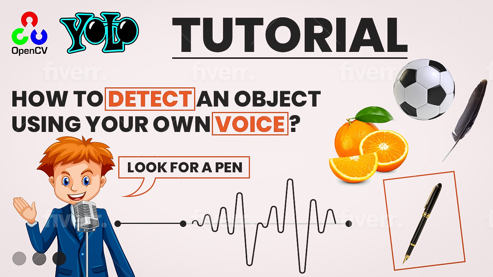

# How to Build a Real-Time Object Detection with your own voice

  

##
   

In this video, we'll show you how to create a voice-controlled object detection system using the YOLO (You Only Look Once) algorithm. By combining object detection with speech recognition, you can create a system where you can say a word or phrase, and the system will detect the specified object in the camera frame and draw a rectangle around it. This hands-on tutorial will guide you step-by-step through the process of building the system using Python and various audio libraries and Google "speech_recognition".
   
Whether you're interested in learning about object detection, speech recognition, or just want to build a cool project that combines the two, this tutorial is for you. You'll learn about YOLO, how to set up the necessary libraries, how to train your model, and how to use voice commands to detect specific objects in real-time. By the end of this tutorial, you'll have a fully functional voice-controlled object detection system that you can use to impress your friends or even integrate into your own projects.

   
You can find the link for the [tutorial](https://youtu.be/fd1msoIpM5Q) here. 

You can find more cool Tensorflow projects and tutorials in this [playlist](https://www.youtube.com/watch?v=fd1msoIpM5Q&list=PLdkryDe59y4bxVvpexwR6PMTHH6_vFXjA)

Enjoy

Eran
   

# Recommended courses and relevant products 

If you are interested in learning modern Computer Vision course with deep dive with TensorFlow , Keras and Pytorch , you can find it [here](http://bit.ly/3HeDy1V).

Perfect course for every computer vision enthusiastic

Before we continue , I actually recommend this [book](https://amzn.to/3STWZ2N) for deep learning based on Tensorflow and Keras : 

# Connect

If you have any suggestions about papers, feel free to mail me :)

- [▶️ Youtube.com/@eranfeit](youtube.com/@eranfeit?sub_confirmation=1)
- [🌐 My Website](https://eranfeit.net)
- [🐙 Facebookl](https://www.facebook.com/groups/3080601358933585)
- [🖥️ Email](mailto:feitgemel@gmail.com)
- [🐦 Twitter](https://twitter.com/eran_feit )
- [😸 GitHub](https://github.com/feitgemel)
- [📸 Instagram](https://www.instagram.com/eran_feit/)

