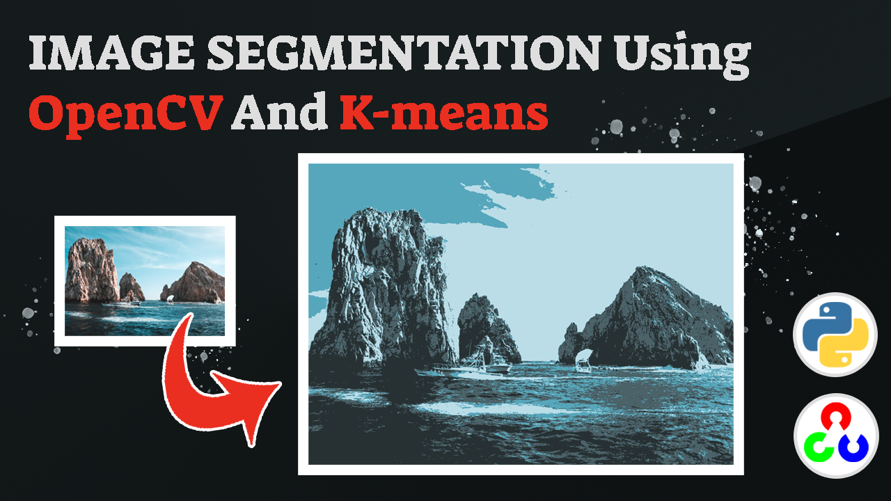

# Python Image Segmentation Made Easy with OpenCV and K-means Algorithm

  

##
   

In this tutorial, you will learn how to perform image segmentation using Python, OpenCV, and K-means clustering. Image segmentation is a fundamental task in computer vision, which involves dividing an image into multiple segments or regions based on certain criteria. By segmenting an image, you can extract useful information about the objects, shapes, and colors present in the image, which is important for various applications such as object detection, tracking, and recognition.
   
In this video, you will first learn how to load an image into Python and preprocess it using OpenCV to convert it to a suitable format for input to the K-means clustering algorithm. You will then apply the K-means algorithm to the preprocessed image and specify the desired number of clusters. Finally, you will demonstrate how to obtain the image segmentation by assigning each pixel in the image to its corresponding cluster, and you will show how the segmentation changes when you vary the number of clusters.

   
You can find the link for the [tutorial](https://youtu.be/a2Kti9UGtrU) here. 

You can find more cool Tensorflow projects and tutorials in this [playlist](https://www.youtube.com/watch?v=fd1msoIpM5Q&list=PLdkryDe59y4bxVvpexwR6PMTHH6_vFXjA)

Enjoy

Eran
   

# Recommended courses and relevant products 

If you are interested in learning modern Computer Vision course with deep dive with TensorFlow , Keras and Pytorch , you can find it [here](http://bit.ly/3HeDy1V).

Perfect course for every computer vision enthusiastic

Before we continue , I actually recommend this [book](https://amzn.to/3STWZ2N) for deep learning based on Tensorflow and Keras : 

# Connect

If you have any suggestions about papers, feel free to mail me :)

- [▶️ Youtube.com/@eranfeit](youtube.com/@eranfeit?sub_confirmation=1)
- [🌐 My Website](https://eranfeit.net)
- [🐙 Facebookl](https://www.facebook.com/groups/3080601358933585)
- [🖥️ Email](mailto:feitgemel@gmail.com)
- [🐦 Twitter](https://twitter.com/eran_feit )
- [😸 GitHub](https://github.com/feitgemel)
- [📸 Instagram](https://www.instagram.com/eran_feit/)

